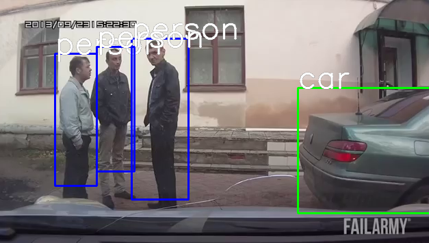

# Object detection in dashcam video(s)
## Using the SSD: Single Shot MultiBox Object Detector



[Single Shot MultiBox Detector](http://arxiv.org/abs/1512.02325) from the 2016 paper by Wei Liu, Dragomir Anguelov, Dumitru Erhan, Christian Szegedy, Scott Reed, Cheng-Yang, and Alexander C. Berg. 
Code: [here](https://github.com/amdegroot/ssd.pytorch)

### Installation Instructions

```
apt-get install python3

git clone http://github.com/florinsch/dashcamssd

cd dashcamssd

pip3 install -r requirements.txt

wget -c https://s3.amazonaws.com/amdegroot-models/ssd_300_VOC0712.pth -P weights/ 
```


### Data: 
Search youtube for "dashcam":
https://www.youtube.com/watch?v=NGM8onreGcU

Alternatively try:
https://research.google.com/youtube8m/explore.html

Videos can be downloaded using various online tools, e.g. https://y2mate.com/

### Demo:

`python3 demo.py`